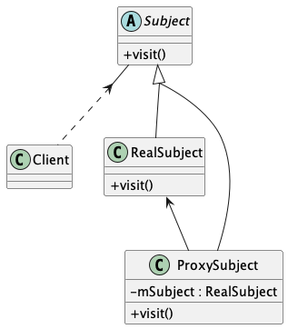

# Proxy Pattern

代码对应的是 `template` 目录下的 `java` 文件

[代理模式模版代码示例](https://github.com/zhanzengyu/DesignPatternsPratices/tree/proxy_pattern/src/template)

## 静态代理
代码对应的是 `staticproxy` 目录下的 `java` 文件

[静态代理代码示例](https://github.com/zhanzengyu/DesignPatternsPratices/tree/proxy_pattern/src/staticproxy)

## 动态代理
代码对应的是 `dynamicproxy` 目录下的 `java` 文件

[动态代理代码示例](https://github.com/zhanzengyu/DesignPatternsPratices/tree/proxy_pattern/src/dynamicproxy)